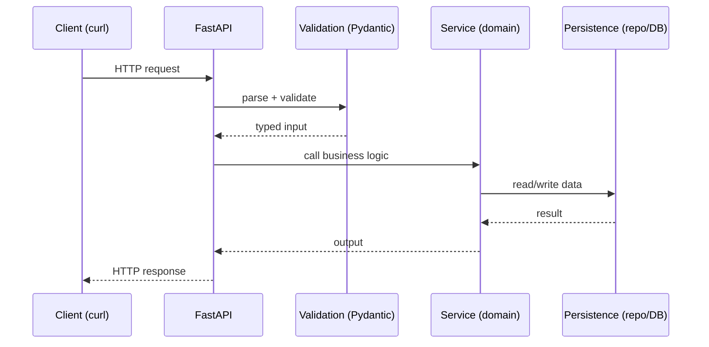

### Week 1 / Session 1 — HTTP request lifecycle (no framework mysticism)

#### Goal
Be able to explain, verbally and on a whiteboard: **“What happens when a request hits my API?”**

---

### Why this matters (reasoning)
If you can’t explain the request lifecycle, you can’t debug confidently. Frameworks feel “magical” when you don’t know:
- where input is validated
- where business rules should live
- where persistence happens
- where errors should be translated to HTTP responses

Backend/platform work is largely about **building reliable, explainable request pipelines**.

---

### Theory (must know)

#### HTTP fundamentals (only the useful parts)
- **Method semantics**
  - `GET` = read
  - `POST` = create
  - `PUT` = replace
  - `PATCH` = partial update
  - `DELETE` = delete
- **Idempotency**
  - `GET`, `PUT`, `DELETE` are typically idempotent
  - `POST` is typically not
- **Status codes (minimum set)**
  - `200 OK`: successful read
  - `201 Created`: successful create
  - `204 No Content`: successful delete/update with no body
  - `400 Bad Request`: invalid input
  - `401 Unauthorized`: not authenticated
  - `403 Forbidden`: authenticated but not allowed
  - `404 Not Found`: resource doesn’t exist
  - `409 Conflict`: violates uniqueness / state constraints
  - `500 Internal Server Error`: unexpected bug

#### Request lifecycle (what actually happens)
At a high level:
1. **Transport parsing**: server reads bytes → HTTP request (method/path/headers/body)
2. **Routing**: framework matches method+path to a handler
3. **Dependency resolution**: FastAPI builds dependencies (later: DB session, current user)
4. **Validation/coercion**: request body/path/query → typed Pydantic model
5. **Business logic**: service decides what should happen
6. **Persistence**: data is read/written (later: SQLAlchemy)
7. **Serialization**: response model → JSON
8. **Error translation**: known failures → correct HTTP codes

#### Validation vs business rules (critical distinction)
- **Validation**: “is the shape/type acceptable?” (e.g., title is a string, length > 0)
- **Business rule**: “is this allowed in our domain?” (e.g., title must be unique)

If you put business rules only in validation, you’ll struggle when rules depend on DB state.

---

### Flow diagram (curl → response)

---

### Do / Don’t
- **Do**: treat endpoints as **transport adapters** (thin)
  - Reason: this keeps logic testable and reduces coupling to FastAPI.
- **Do**: translate failures into deliberate HTTP errors
  - Reason: clients depend on stable semantics (400 vs 404 vs 409).
- **Do**: keep request/response models separate from persistence models
  - Reason: transport shapes change for API ergonomics; DB shapes change for integrity/performance.
- **Don’t**: put business logic directly in route handlers
  - Reason: you will duplicate rules and produce inconsistent behavior across endpoints.
- **Don’t**: “just add async” unless you can explain why it helps
  - Reason: async adds complexity; it only helps when you’re I/O bound and your stack supports it correctly.

---

### Common failure modes (and solutions)
- **Symptom**: “Why is this returning 200 when it should be 404?”
  - **Cause**: handler returns `None` or empty dict instead of raising an HTTP error.
  - **Solution**: decide which failures are expected, raise `HTTPException(status_code=404, ...)`.
- **Symptom**: “I’m getting 422 validation errors and I don’t understand why.”
  - **Cause**: Pydantic rejected the payload shape/types.
  - **Solution**: print the request JSON you’re sending, compare with the Pydantic model, reduce to minimal failing payload.
- **Symptom**: “It works in code but breaks in curl.”
  - **Cause**: missing headers (e.g., `Content-Type: application/json`) or wrong quoting.
  - **Solution**: start with `/docs` “Try it out”, then copy curl from the UI.

---

### Practical session (code)
Build a minimal Todo API with **in-memory persistence**.

Run:
- `python course/code/week-01/todo_inmemory.py`
- visit `http://127.0.0.1:8000/docs`

Code:
- `course/code/week-01/todo_inmemory.py`

---

### Reflection prompts (5 minutes)
- If a request fails, where should that error be handled (API vs domain vs persistence)?
- What’s the difference between **validation error** and **not found**?

#### “Explain it” solution (what good sounds like)
In your own words, you should be able to say something like:
- “FastAPI routes the request to a handler, validates the input into a typed model, then calls domain/service logic. The service uses a persistence layer to read/write state. Finally FastAPI serializes a response model, and known errors become explicit HTTP status codes.”
