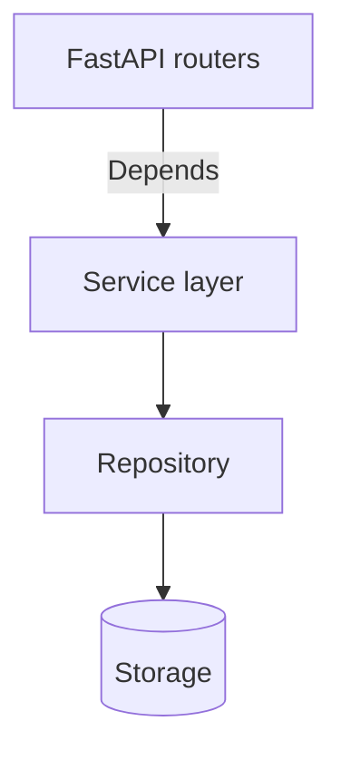
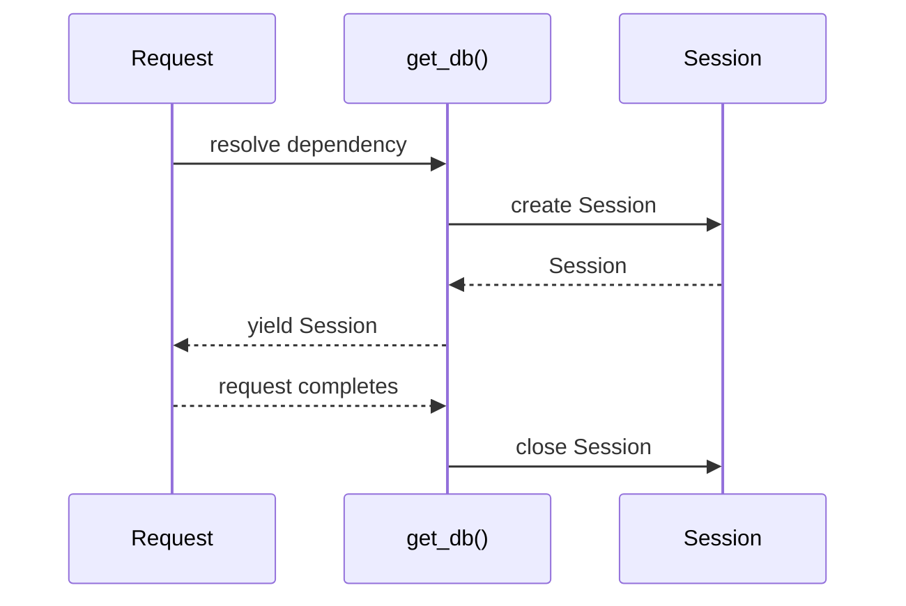

### Week 1 / Session 2 — Dependency Injection (FastAPI as architecture tool)

#### Goal
Use dependency injection (DI) to make architecture real:
- endpoints stay thin
- services stay framework-free
- persistence is swappable

---

### Why this matters (reasoning)
Platform/IAM-adjacent backend engineers spend a lot of time making systems:
- easy to change safely
- easy to test (without real DBs/IdPs)
- easy to reason about under incident pressure

DI is the mechanism that turns “clean architecture” from a diagram into *running code*.

---

### Theory (must know)

#### What DI is doing for you
DI is how you:
- centralize wiring (what uses what)
- standardize lifetimes (per-request DB sessions later)
- remove hidden globals

#### The “composition root” idea
One place in your app should own wiring decisions:
- how services are constructed
- what repository implementation is used
- how configuration is loaded

In FastAPI, dependency functions (`get_service()`, `get_db()`) are your early composition root.

#### Architecture diagram (layers + DI)

---

### Do / Don’t
- **Do**: inject services into endpoints
  - Reason: route handlers become easy to read and hard to break.
- **Do**: inject repos into services (directly or via wiring function)
  - Reason: you can swap persistence (in-memory vs SQLAlchemy) without rewriting domain logic.
- **Do**: make dependency lifetimes explicit
  - Reason: DB sessions and network clients need deterministic cleanup.
- **Don’t**: import FastAPI inside the domain/service layer
  - Reason: that couples your domain logic to the web framework and makes unit tests harder.
- **Don’t**: let handlers grow into “mini-apps”
  - Reason: you’ll duplicate logic across endpoints and regress behavior during refactors.

---

### Common failure modes (and solutions)
- **Symptom**: “My service can’t be tested without spinning up FastAPI.”
  - **Cause**: service imports `Depends` or `HTTPException`.
  - **Solution**: service raises domain exceptions; router translates to HTTP.
- **Symptom**: “I’m creating DB sessions everywhere and forgetting to close them.”
  - **Cause**: no single dependency for session lifecycle.
  - **Solution**: implement `get_db()` using `yield` and inject it.
- **Symptom**: “Everything is global and state leaks between tests.”
  - **Cause**: global mutable stores/clients used directly.
  - **Solution**: wrap global state behind a repository and inject a fresh instance for tests.

---

### Worked example (wiring vs business logic)
Keep *wiring* in dependencies, keep *rules* in services.

Example rule location:
- “Title must be non-empty”: validation layer (Pydantic) **and** service (defensive)
- “Title must be unique”: service + DB constraint (Week 2/3)

#### Example: request-scoped lifetime (preview)
When you add a DB, the lifetime pattern looks like this:

This is why `yield` dependencies matter: cleanup happens even if the request errors.

---

### Practical session (code)
Refactor Todo into service + repo with FastAPI dependencies.

Run:
- `python course/code/week-01/todo_di.py`

Code:
- `course/code/week-01/todo_di.py`

---

### Mini-checkpoint (10 minutes)
Answer out loud:
- What changes if we swap the repository implementation?
- Where is the “wiring” located?

