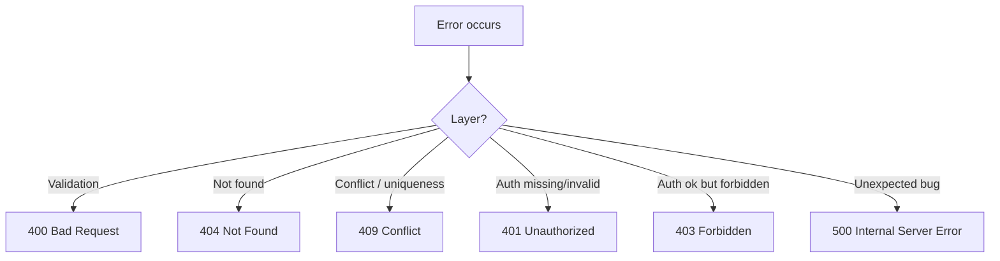

### Week 1 / Session 3 — Boundaries: validation vs persistence vs domain + error translation

#### Goal
Be able to locate bugs faster by asking: **“what layer am I in?”**

---

### Why this matters (reasoning)
Most debugging time is wasted because engineers treat systems as one blob. When you can name layers, you can:
- identify which contracts are being violated
- write fixes in the correct place (and prevent regressions)
- explain failures to teammates and stakeholders clearly

This is a core “platform engineer” habit.

---

### Theory (must know)

#### Layer responsibilities
- **API/Transport**: HTTP, status codes, request/response shapes
- **Validation**: input constraints, parsing, types (Pydantic)
- **Domain/Service**: business rules and invariants
- **Persistence**: storing/retrieving data; translating domain needs into queries

#### Boundary rule of thumb
If something must be true regardless of UI/framework, it belongs in **domain/service**.
If something is about HTTP semantics, it belongs in **API/transport**.

#### Error translation flow

---

### Do / Don’t
- **Do**: raise domain errors (e.g. `ValueError`, custom exceptions) and translate in API layer
  - Reason: your service stays testable and framework-agnostic.
- **Do**: treat persistence errors as signals for conflicts or missing records
  - Reason: the DB is the source of truth for uniqueness and referential integrity.
- **Do**: keep error messages stable and non-leaky
  - Reason: security and client compatibility (don’t leak internals).
- **Don’t**: leak raw stack traces and DB exceptions to clients
  - Reason: it reveals internal implementation details and creates unstable APIs.
- **Don’t**: encode business rules only in Pydantic validators
  - Reason: many rules require DB state (uniqueness, quotas, permissions).

---

### Example mappings (solutions)
These are common backend mappings that keep systems predictable:
- **Pydantic validation error** → `400` (or FastAPI’s default `422` if you accept it)
- **Domain “not found”** → `404`
- **Domain “not allowed”** → `403` (AuthZ) or `409` (state conflict), depending on meaning
- **DB unique constraint violation** → `409`
- **Unexpected exception** → `500` (and log it)

#### Pattern: domain exception → HTTP translation
You can formalize this with a small mapping layer:
- service raises `TodoNotFound`, `TodoConflict`
- router catches and converts to `HTTPException`

---

### Practical session
Add:
- `PUT /todos/{id}` (replace)
- `PATCH /todos/{id}` (partial update)
- Proper status codes and error mapping

Suggested approach:
1. Add service methods
2. Add repository operations
3. Keep endpoint handlers thin

---

### Common failure modes (and solutions)
- **Symptom**: “I’m not sure whether to return 400 or 404.”
  - **Solution**: 400 = request is invalid; 404 = request is valid but resource doesn’t exist.
- **Symptom**: “Uniqueness checks are flaky.”
  - **Solution**: enforce uniqueness in the DB and treat the DB error as the final arbiter (then translate to 409).
- **Symptom**: “I can’t tell where the bug lives.”
  - **Solution**: reproduce with the smallest input, then trace layer-by-layer (validation → service → persistence).

---

### Reflection prompts (5 minutes)
- Which errors are “client mistakes” vs “system mistakes”?
- Where should uniqueness constraints live (DB vs service vs both)?

