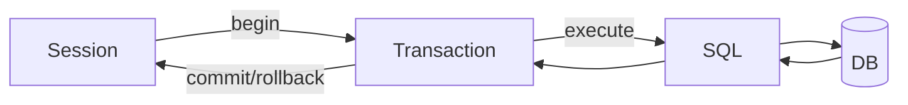

### Week 2 / Session 2 — SQLAlchemy mental model (Core vs ORM, Engine/Metadata/Session)

#### Goal
Know which layer you’re touching and why—so SQLAlchemy stops feeling “random”.

---

### Why this matters (reasoning)
SQLAlchemy becomes painful when it’s treated like “magic Python objects that talk to the DB”.
It becomes straightforward when you treat it as:
- **Core**: a safe way to *construct SQL*
- **ORM**: a way to *project relational rows into objects* with identity + relationships

If you’re IAM/platform-adjacent, this matters because you will debug production issues like:
- “Why is this request holding a DB transaction open?”
- “Why did this update not persist?”
- “Why are we doing 200 queries for one endpoint?” (N+1)

---

### Theory (must know)

#### Core vs ORM
- **SQLAlchemy Core**: SQL constructs (tables, columns, select/join), result rows
- **SQLAlchemy ORM**: maps rows to objects, identity map, relationship loading

Both exist because:
- Core is explicit and close to SQL (great for learning and advanced queries)
- ORM improves ergonomics when you understand the schema

#### The three nouns you must separate
- **Metadata**: table definitions (schema in code)
- **Engine**: how you talk to the database (connection pool)
- **Session**: unit-of-work + identity map + transaction boundary

#### Session deeper mental model (what’s inside)
- **Identity map**: within a Session, “the movie with id=1” is a single Python object.
  - This is why you can query the same row twice and get the *same instance*.
- **Unit of work**: Session tracks what changed and writes it on `flush()` / `commit()`.
- **Transaction boundary**: commit/rollback decides whether changes persist.

#### Flush vs commit (common confusion)
- `flush()` sends SQL to the DB but does not end the transaction
- `commit()` ends the transaction and persists changes

In web apps, you typically commit once per request (when the business operation succeeds).

#### Why common errors happen
- “**tables already exist**”: you ran `create_all()` on a DB that already has tables (or you changed metadata and re-ran without migrations)
- “**mapper/relationship** errors”: ORM definitions don’t match the schema you think you have
- “**copy-paste order** problems”: metadata must be defined before you call `create_all()`

#### The N+1 problem (ORM-specific failure mode)
When you loop over objects and access a lazy-loaded relationship, the ORM may issue extra queries per row.
- **Symptom**: endpoint is slow and DB logs show many repeated selects
- **Solution**: eager load (e.g., `selectinload/joinedload`) or write explicit joins

---

### Flow diagram (Session / transaction)

---

### Do / Don’t
- **Do**: treat Session as request-scoped in web apps
  - Reason: it aligns transaction scope with a business operation.
- **Do**: close sessions (or use `yield` dependencies)
  - Reason: it releases connections back to the pool.
- **Do**: keep Engine as a process-wide singleton
  - Reason: engine manages pooling; recreating it defeats pooling.
- **Don’t**: create a new Engine per request
  - Reason: you’ll leak connections and lose pooling benefits.
- **Don’t**: rely on `create_all()` as a “migration system”
  - Reason: schema changes need explicit migrations (Alembic) to be safe and repeatable.

---

### Common failure modes (and solutions)
- **Symptom**: “I updated fields but nothing changed in the DB.”
  - **Cause**: no `commit()` (or transaction rolled back).
  - **Solution**: commit at the end of the request; log rollbacks.
- **Symptom**: “I got stale data after updating.”
  - **Cause**: identity map caching within a long-lived Session.
  - **Solution**: keep Session short-lived; refresh objects when needed.
- **Symptom**: “Performance is terrible with relationships.”
  - **Cause**: N+1 queries due to lazy loading.
  - **Solution**: eager-load or write explicit join queries.

---

### Practical session (mapping the exact schema)
You will:
1. implement the schema in ORM
2. insert a movie with genres
3. query with relationships

Run:
- `python course/code/week-02/sqlalchemy_movies_orm.py`

