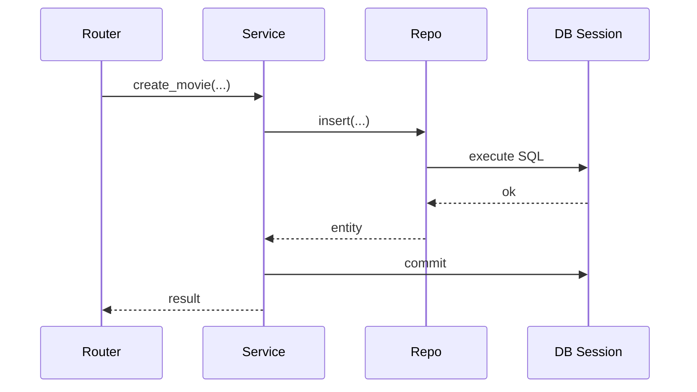

### Week 2 / Session 3 — FastAPI + DB integration (DI for sessions, repos for queries)

#### Goal
Wire DB access into FastAPI without breaking architecture.

---

### Why this matters (reasoning)
Most “mysterious DB bugs” in web apps come from *lifetime mistakes*:
- sessions not closed
- transactions left open
- engines recreated too often
- business operations split across multiple implicit transactions

Correct DI around database sessions is one of the highest-leverage backend skills.

---

### Theory (must know)

#### Correct responsibility split
- **FastAPI dependency** creates + cleans up the Session
- **Repository** executes DB operations
- **Service** implements business rules
- **Router** translates errors to HTTP and stays thin

#### Transaction boundary rule
For most CRUD APIs:
- 1 request = 1 Session = 1 transaction (commit on success, rollback on failure)

Later, you can evolve this for background jobs or multi-step workflows, but this is the stable default.

#### Worked example: where commit/rollback lives (solution)
Pick one convention and stick to it:
- **Service commits**: service owns the business operation boundary
- **Repo commits**: repo owns persistence boundary

For most teams, “service commits” reads better because it matches intent:



If anything fails mid-operation, rollback once, at the boundary.

#### Layer diagram

```mermaid
flowchart TB
  R[Router/Endpoint] -->|Depends| SVC[Service]
  SVC --> REPO[Repository]
  R -->|Depends| DBDEP[get_db() yields Session]
  REPO --> DB[(DB)]
  DBDEP --> DB
```

---

### Do / Don’t
- **Do**: use `yield` dependencies to guarantee close/cleanup
  - Reason: even on exceptions, cleanup happens.
- **Do**: commit intentionally (in repo or service—pick one convention)
  - Reason: implicit commits create “it worked locally” bugs.
- **Do**: keep SQLAlchemy imports mostly in infra/repo modules
  - Reason: it prevents ORM leakage into your domain layer.
- **Don’t**: pass Sessions everywhere “just because”; pass repos/services
  - Reason: it turns your codebase into “SQL everywhere”.
- **Don’t**: return ORM objects directly from endpoints
  - Reason: serialization triggers lazy loads and can leak internal fields.

---

### Common failure modes (and solutions)
- **Symptom**: “SQLite says database is locked” / Postgres shows many idle transactions.
  - **Cause**: sessions not closed or transactions not committed/rolled back.
  - **Solution**: `yield get_db()` dependency + commit/rollback discipline.
- **Symptom**: “My endpoint returns 500 with a long DB trace.”
  - **Cause**: DB errors aren’t translated to domain/API errors.
  - **Solution**: catch and translate known DB exceptions to `409/404` where appropriate.
- **Symptom**: “Random connection errors under load.”
  - **Cause**: creating Engines too frequently, exhausting connections.
  - **Solution**: global Engine + request-scoped Session.

---

### Practical session
Run a tiny FastAPI app that checks DB connectivity and demonstrates `get_db()` lifecycle.

Run:
- `python course/code/week-02/fastapi_db_dependency.py`

