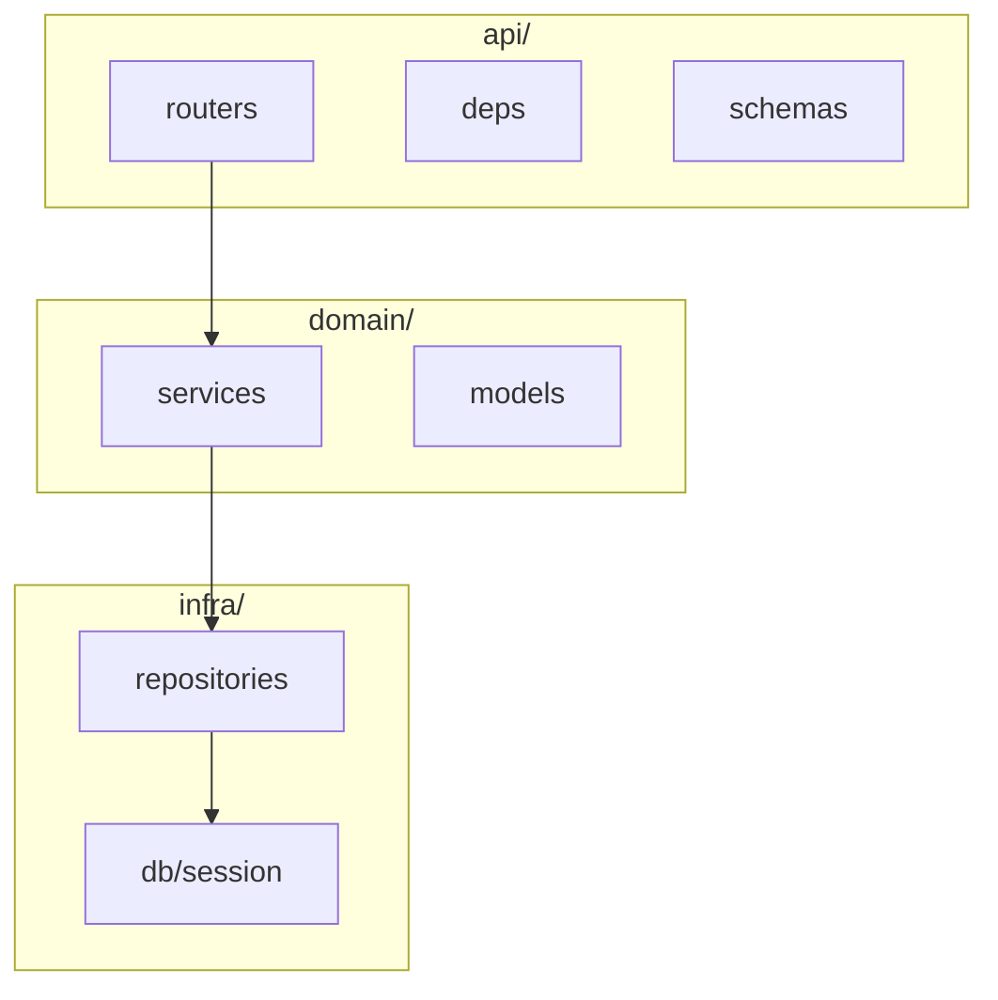

### Week 3 / Session 1 — Architecture boundaries (refactor-driven)

#### Goal
Move from “tutorial code” to **system-shaped code**.

---

### Why this matters (reasoning)
Self-taught engineers often plateau because their codebase grows without clear seams. Clear boundaries give you:
- faster debugging (you know where to look)
- safer changes (small blast radius)
- testability (domain logic without frameworks)
- better team collaboration (files communicate intent)

This is also how platform/IAM engineers keep security logic from getting scattered across endpoints.

---

### Target architecture (folders)

```text
app/
  api/
    routers/
    deps.py
    schemas.py
  domain/
    services/
    models/
  infra/
    db.py
    repositories/
tests/
```

#### Layer diagram



---

### Do / Don’t
- **Do**: keep `domain/` free of FastAPI imports
- **Do**: keep SQLAlchemy usage in `infra/` repositories
- **Do**: treat routers as adapters (validate/translate/call service)
- **Don’t**: add patterns without pain (keep it lightweight)
- **Don’t**: allow circular imports between layers

#### What belongs where (examples)
- **api/**: Pydantic request/response models, HTTP errors, dependency wiring
- **domain/**: business rules (“a movie year must be >= 1888”), domain exceptions
- **infra/**: SQLAlchemy models, DB sessions, repo implementations, integrations

---

### Common failure modes (and solutions)
- **Symptom**: “I’m importing the DB session into every file.”
  - **Cause**: no repository boundary.
  - **Solution**: only repos accept Sessions; services accept repos.
- **Symptom**: “Endpoints are 200 lines long.”
  - **Cause**: router doing validation + business rules + persistence.
  - **Solution**: move rules to service, DB calls to repo, keep router as adapter.
- **Symptom**: “Refactors break everything.”
  - **Cause**: cross-layer coupling and circular imports.
  - **Solution**: enforce one-way dependencies (API → domain → infra).

---

### Practical session
Take your existing Week 2 “Movies” logic and refactor into:
- `MovieService` (business rules)
- `MovieRepository` (SQLAlchemy)
- FastAPI router that calls the service

Reference example code:
- `course/code/week-03/service_repo_example.py`

