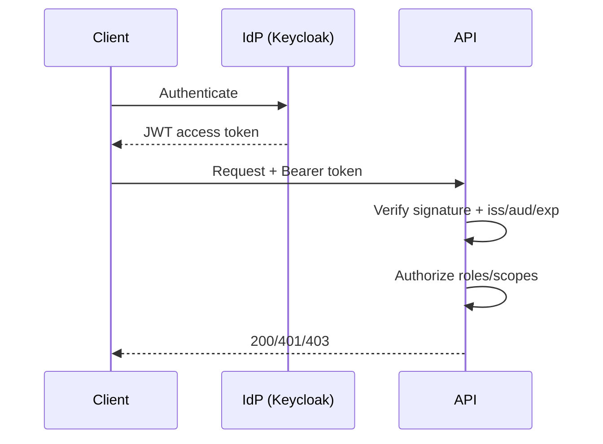

### Week 4 — Lab Solution (reference)

#### Goal
Secure endpoints with correct 401/403 behavior and document the trust flow.

---

## Part A — Enforce 401 vs 403 (solution)

### Rules
- **401**: missing or invalid token
- **403**: valid token but insufficient permissions

### Reference implementation (learning-only mock auth)
Use:
- `course/code/week-04/rbac_deps_example.py` (starter)

Or the slightly richer reference solution:
- `course/code/week-04/rbac_deps_solution.py`

---

## Part B — Curl proofs (solution)

Start:

```bash
python course/code/week-04/rbac_deps_solution.py
```

Missing token → 401:

```bash
curl -i http://127.0.0.1:8004/admin
```

Invalid token → 401:

```bash
curl -i -H 'Authorization: Bearer nope' http://127.0.0.1:8004/admin
```

User token (no admin role) → 403:

```bash
curl -i -H 'Authorization: Bearer user' http://127.0.0.1:8004/admin
```

Admin token → 200:

```bash
curl -i -H 'Authorization: Bearer admin' http://127.0.0.1:8004/admin
```

---

## Part C — Trust narrative (solution)
A correct short narrative:
- “Keycloak (issuer) authenticates the user and issues a short-lived access token for my API (audience). My API verifies the token signature using the issuer’s JWKS and validates issuer/audience/expiry. Then my API enforces authorization by checking roles/scopes in verified claims.”

---

## Part D — `SECURITY.md` template (solution)
Include:
- trust flow diagram
- which claims you trust (and why)
- roles and permissions
- example curl calls (200/401/403)

Mermaid starting point:



