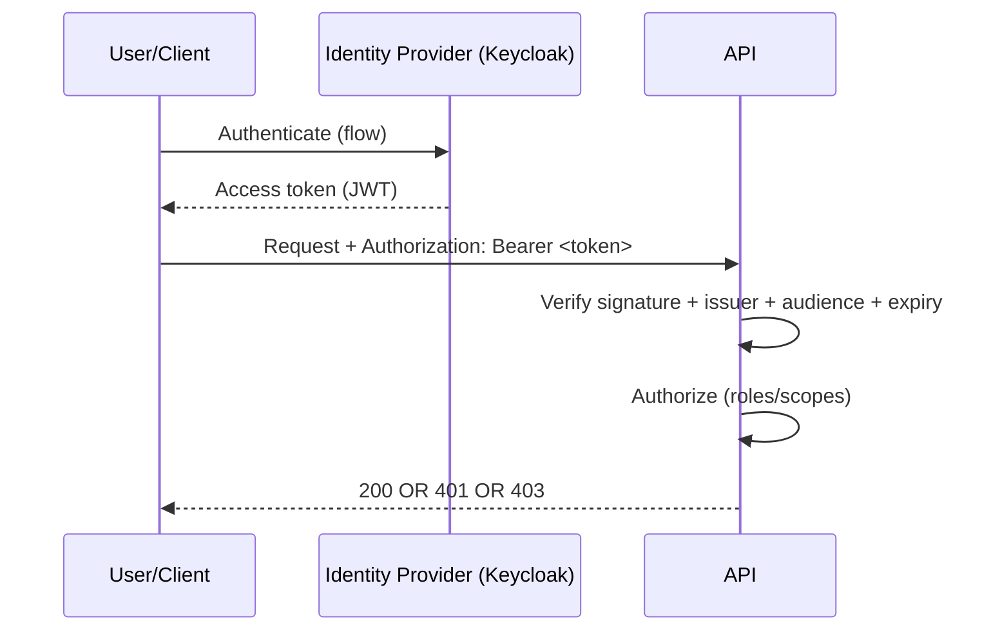

### Week 4 / Session 1 — Authentication vs Authorization (deeply)

#### Goal
Turn “auth” from vibes into a story you can explain end-to-end.

---

### Why this matters (reasoning)
In IAM-adjacent backend work, “auth” is not a feature; it’s a **trust system**.
If you can’t explain trust flow, you will:
- ship broken authorization (the most common real-world security failure)
- be unable to debug incidents (401 vs 403 vs token confusion)
- struggle with Keycloak/OAuth because they feel like “spec soup”

We start with narratives and capabilities, not RFCs.

---

### Theory (must know)

#### Definitions
- **Authentication (AuthN)**: who are you?
- **Authorization (AuthZ)**: what can you do?

#### 401 vs 403 (non-negotiable)
- **401 Unauthorized**: missing/invalid credentials (not authenticated)
- **403 Forbidden**: authenticated but not allowed

#### Tokens as capabilities (not magic)
Think of an access token like a capability with constraints:
- **issuer**: who created it
- **audience**: who it is intended for
- **expiry**: when it stops being valid
- **claims**: what the subject can do (roles/scopes)

#### Sessions vs JWTs (tradeoffs)
- **Session (server-side state)**
  - Pros: revocation is easy; token is opaque; less claim leakage
  - Cons: requires server-side storage; horizontal scaling needs shared store
- **JWT (self-contained)**
  - Pros: stateless verification; good for service-to-service; fewer round trips
  - Cons: revocation is hard; claim mistakes are dangerous; needs correct validation

Rule of thumb:
- user-facing apps often prefer sessions (or short-lived JWT + refresh)
- service-to-service often prefers JWT/mTLS depending on environment

#### OAuth2 in one sentence (narrative)
OAuth2 is a set of flows for how a client obtains a token from an authorization server **without sharing the user’s password with the client**.

---

### Trust flow diagram

---

### Do / Don’t
- **Do**: validate issuer/audience/expiry (not just “decode”)
- **Do**: treat authorization rules as code (dependencies/services), not comments
- **Don’t**: store access tokens in logs
- **Don’t**: mix “app roles” with “cloud IAM roles” (different layers)

#### Do / Don’t (expanded reasoning)
- **Do**: enforce authorization on the server, even if the UI hides buttons
  - Reason: attackers don’t use your UI.
- **Do**: default-deny
  - Reason: it prevents “new endpoint forgot auth” failures.
- **Don’t**: trust client-provided roles/scopes
  - Reason: only trust claims after signature + issuer/aud validation.

---

### Common failure modes (and solutions)
- **Symptom**: everything returns 403
  - **Cause**: you’re treating “missing token” as forbidden.
  - **Solution**: 401 when missing/invalid token; 403 when authenticated but lacking permission.
- **Symptom**: tokens “work” but the wrong API accepts them
  - **Cause**: missing audience validation.
  - **Solution**: validate `aud` and `iss` every time.
- **Symptom**: roles behave inconsistently across environments
  - **Cause**: roles stored in different claim locations (realm vs client roles).
  - **Solution**: standardize claim extraction logic and document it.

---

### Practical session
Run a minimal RBAC-protected FastAPI app (token validation is mocked for learning).

Run:
- `python course/code/week-04/rbac_deps_example.py`

