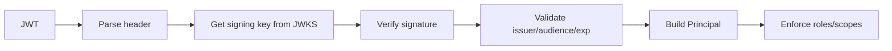

### Week 4 / Session 3 — Keycloak basics + JWT verification sketch

#### Goal
Understand Keycloak at the “can ship a secure demo” level:
- realm, client, user, role
- obtain a token
- verify token and enforce roles in FastAPI

---

### Why this matters (reasoning)
Keycloak (and any IdP) is valuable when you understand the division of responsibility:
- IdP handles user authentication + token issuance
- your API handles token verification + authorization decisions

If you blur this boundary, you end up:
- calling Keycloak for every request (slow, fragile)
- trusting unverified tokens (unsafe)
- implementing authorization “in the UI” (broken)

---

### Keycloak concepts (minimum viable)
- **Realm**: security boundary / namespace (issuer changes by realm)
- **Client**: an application that requests tokens (your API or your frontend)
- **User**: identity principal
- **Role**: authorization grouping

#### Realm roles vs client roles (Keycloak nuance)
- **Realm roles**: global within the realm (often put in `realm_access.roles`)
- **Client roles**: scoped to a specific client (often in `resource_access[client].roles`)

Pick one strategy for the course and document where you read roles from.

---

### Verification flow (high level)

---

### Do / Don’t
- **Do**: validate issuer and audience (prevents token confusion)
- **Do**: cache JWKS keys (performance and stability)
- **Don’t**: accept tokens from “any issuer”
- **Don’t**: treat access tokens like identity proofs for everything (they’re scoped)

#### Why JWKS exists (reasoning)
For asymmetric signing (RS256):
- Keycloak signs tokens with a private key
- APIs verify tokens with the public key
JWKS is how APIs discover public keys (and handle rotation).

---

### Common failure modes (and solutions)
- **Symptom**: “Signature verification fails sometimes.”
  - **Cause**: key rotation; your API cached an old key too long.
  - **Solution**: use a JWKS client that refreshes; cache with reasonable TTL.
- **Symptom**: “Audience validation fails.”
  - **Cause**: you used the wrong client id / audience settings in Keycloak.
  - **Solution**: standardize expected `aud` and keep it consistent per API.
- **Symptom**: “Roles aren’t in the token where I expected.”
  - **Cause**: realm roles vs client roles mismatch.
  - **Solution**: inspect the decoded (unverified) token for shape, then implement extraction based on your chosen model.

---

### Practical session (code)
This example shows:
- how JWT verification is typically wired
- how to build a `Principal`

Code:
- `course/code/week-04/jwt_verify_sketch.py`

Note:
This sketch assumes a real Keycloak, but it’s safe to read/run even without one.

