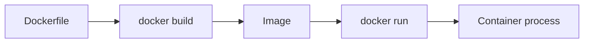

### Week 5 / Session 1 — Docker mental model (confidence > mastery)

#### Goal
Understand what containers are and build a Docker image for a Python API.

---

### Why this matters (reasoning)
Shipping is a core backend/platform skill. Containers solve two recurring problems:
- **reproducibility**: your app runs the same way on any machine
- **dependency isolation**: you control Python + OS libraries + runtime behavior

Docker also forces you to be explicit about configuration, which directly improves security and operability.

---

### Theory (must know)

#### Vocabulary
- **Image**: immutable filesystem snapshot + metadata
- **Container**: a running process created from an image
- **Dockerfile**: recipe to build an image

#### Dockerfile mental model
- Each instruction creates a layer (cache matters)
- Copy deps first, install deps, then copy app code

#### Image build lifecycle (conceptual)

#### Why COPY order matters (practical)
If you `COPY . .` before installing dependencies, any code change invalidates the cache and forces a full reinstall.
Better pattern:
1. copy dependency files
2. install deps
3. copy the app

#### Containers are “processes with packaging”
A container is not a VM. It’s a Linux process started with:
- an isolated filesystem view
- isolated networking namespace
- resource limits (optional)

---

### Do / Don’t
- **Do**: keep images small (`python:slim` is a good start)
- **Do**: configure via environment variables (12-factor)
- **Don’t**: bake secrets into images
- **Don’t**: mount your entire home directory into containers “just because”

#### Do / Don’t (expanded reasoning)
- **Do**: add a `.dockerignore`
  - Reason: prevents copying large/unneeded files into the build context (faster builds, fewer leaks).
- **Do**: run as a non-root user in production images (later)
  - Reason: reduces blast radius if the process is compromised.
- **Don’t**: `COPY . /app` without thinking
  - Reason: you might copy `.env`, keys, or build artifacts into images.

---

### Common failure modes (and solutions)
- **Symptom**: image builds are slow every time
  - **Cause**: dependency install cache invalidated by COPY order.
  - **Solution**: copy requirements first, install, then copy app code.
- **Symptom**: “works on my machine” but fails in container
  - **Cause**: missing OS dependencies or implicit local state.
  - **Solution**: make dependencies explicit; remove reliance on local paths.
- **Symptom**: secrets accidentally included in images
  - **Cause**: no `.dockerignore`, copying `.env` or credential files.
  - **Solution**: add `.dockerignore`, pass secrets via env/secret manager.

---

### Practical session
Review and run the sample Dockerfile:
- `course/code/week-05/Dockerfile.example`

You’ll use this pattern to dockerize your real project.

