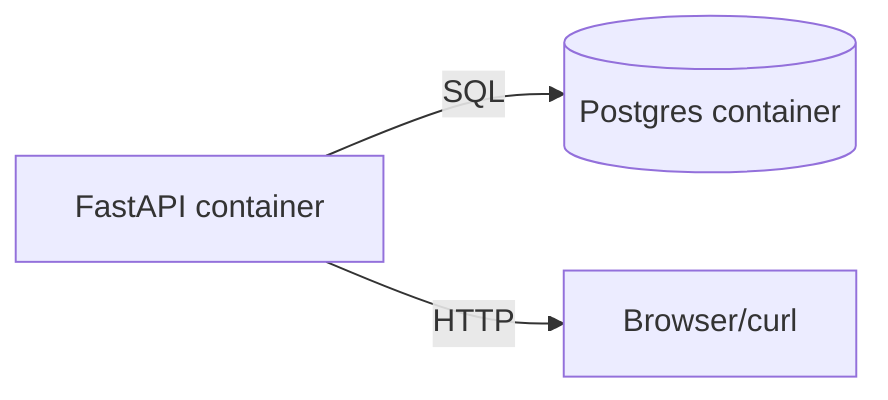

### Week 5 / Session 2 — Docker Compose for local dev (API + DB)

#### Goal
Make your project runnable for a teammate in one command.

---

### Why this matters (reasoning)
Compose gives you “local production enough” so you can:
- onboard teammates quickly
- reproduce bugs reliably
- test integrations (DB, Keycloak) without manual setup steps

It’s not production orchestration, but it is the fastest way to build deployment confidence.

---

### Theory (must know)
- Compose is for **local development orchestration**
- It helps you define:
  - services
  - networks
  - env vars
  - dependencies

#### What Compose does not do
- It does not give you production-grade rollout, autoscaling, or secure secret distribution.
That’s where Kubernetes / managed services come in later.

---

### Flow diagram (local dev)

---

### Do / Don’t
- **Do**: use env vars for DB URLs and secrets
- **Do**: persist DB data using a named volume (optional)
- **Don’t**: expose DB to the public internet in production (Compose is not prod)

#### Do / Don’t (expanded reasoning)
- **Do**: keep Compose files minimal
  - Reason: the goal is reproducible dev, not recreating prod complexity.
- **Do**: healthcheck dependencies (optional)
  - Reason: “depends_on” does not mean “ready”.
- **Don’t**: check real secrets into the repo
  - Reason: treat local dev secrets as throwaway.

---

### Common failure modes (and solutions)
- **Symptom**: API starts before DB is ready
  - **Cause**: `depends_on` only orders startup, not readiness.
  - **Solution**: add retries in app startup or use healthchecks.
- **Symptom**: ports collide (`5432 already in use`)
  - **Cause**: local Postgres already running.
  - **Solution**: change host port mapping (e.g., `5433:5432`) or stop local service.

---

### Practical session
Review the example compose file:
- `course/code/week-05/docker-compose.example.yml`

