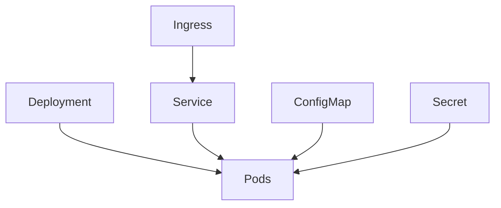

### Week 5 / Session 3 — Kubernetes + AWS concepts (conceptual first)

#### Goal
Build correct mental models without getting trapped in YAML.

---

### Why this matters (reasoning)
Backend/platform engineers are paid for judgment under constraints:
- choosing the right deployment primitive
- applying least privilege
- reasoning about network boundaries and blast radius

This session gives you the vocabulary and causal models so “cloud/infra” stops being scary.

---

## Kubernetes concepts (what it does)

### The one-sentence model
Kubernetes is a control system that continuously tries to make **actual state** match your **desired state**.

### Core objects (minimum viable)
- **Pod**: smallest deployable unit (one or more containers)
- **Deployment**: desired state + rollout strategy for Pods
- **Service**: stable network identity + load balancing to Pods
- **ConfigMap / Secret**: inject configuration into Pods

### What Kubernetes is *actually* doing
- reconciling actual state to desired state (controllers)
- restarting failed processes
- rolling out new versions safely (Deployments)
- providing stable networking abstractions to ephemeral Pods

### Concept flow diagram

### Do / Don’t (Kubernetes mental models)
- **Do**: think “controllers” not “servers”
  - Reason: you declare desired state; the system reconciles it.
- **Do**: separate config from code (ConfigMaps/Secrets)
  - Reason: you can deploy the same image to multiple environments safely.
- **Don’t**: assume Pods are stable or unique
  - Reason: Pods are cattle, not pets; they get replaced frequently.

---

## AWS primitives (selective depth)

### Networking
- **VPC**: private network boundary
- **Subnets**: segmentation inside the VPC (public/private patterns)
- **Security Groups**: stateful firewall rules around resources

### IAM
- **Users**: human identities (rarely used directly for workloads)
- **Roles**: assumed identities for workloads (recommended)

### Critical distinction
**Cloud IAM ≠ App IAM**
- Cloud IAM controls *AWS resource access* (e.g., can this workload call S3?)
- App IAM controls *application permissions* (e.g., can this principal hit `/admin`?)

### Example: service-to-service auth layers
- **Cloud IAM**: can Service A call AWS DynamoDB? (resource permission)
- **App IAM**: can Service A call Service B’s `/admin` endpoint? (application permission)

You often need both.

---

### Do / Don’t (infra security reasoning)
- **Do**: reason in boundaries (“what can talk to what?”)
  - Reason: most incidents are unintended connectivity + over-permission.
- **Do**: apply least privilege by default
  - Reason: permissions expand naturally; they rarely shrink without discipline.
- **Don’t**: conflate “admin in app” with “admin in AWS”
  - Reason: they protect different things and have different blast radius.

---

### Common failure modes (and solutions)
- **Symptom**: everything is reachable from everywhere
  - **Cause**: overly permissive Security Groups / flat networking.
  - **Solution**: segment with subnets/SG rules; explicitly allow only required flows.
- **Symptom**: workloads use long-lived AWS access keys
  - **Cause**: using IAM users for machines.
  - **Solution**: use IAM roles for workloads (assume-role / instance/Pod roles).
- **Symptom**: “Kubernetes is down” becomes the explanation for any bug
  - **Cause**: missing application-level observability and clear boundaries.
  - **Solution**: instrument apps (logs/metrics), and debug layer-by-layer (app → network → cluster).

